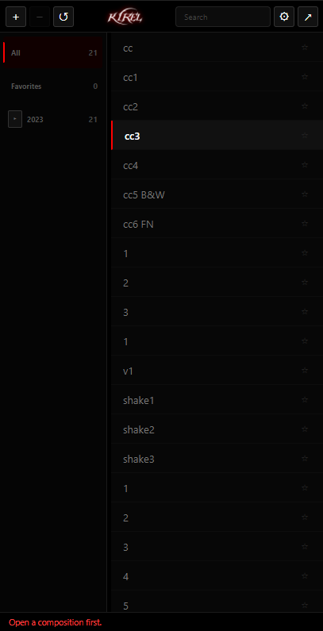
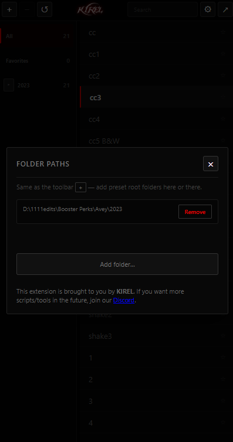

# Project Title

A short description of your project goes here.

## Preview

<div style="display: flex; gap: 10px;">
  
  
</div>

## Release Installation
Download the release and use the bat installer win/mac depends on ur os

## Installation

```bash
# Clone the repository
git clone https://github.com/yourusername/yourproject.git

# Navigate to the project folder
cd yourproject

# Install dependencies
npm install


